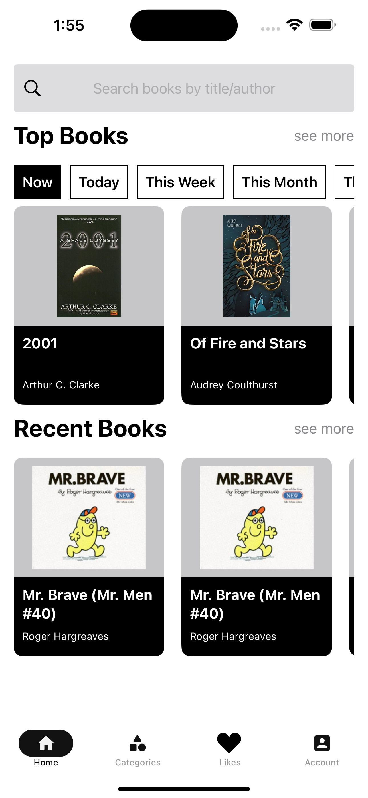
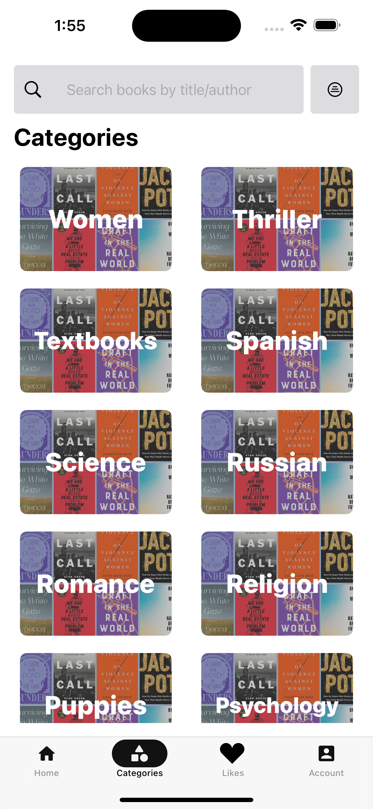
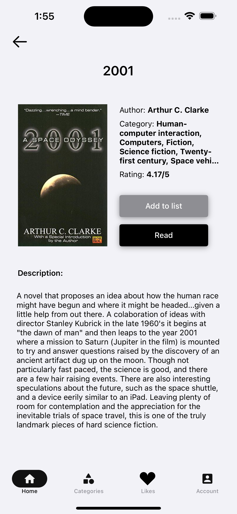
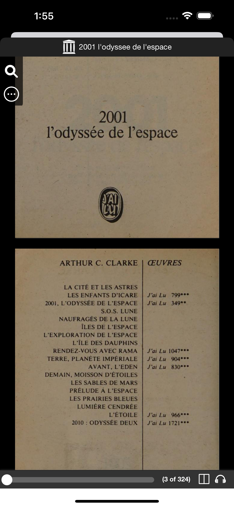

# Challenge № 2 "BookStore App"

# Приложение 'BookStore'
Приложение создано в рамках challenge №2 на марафоне от **DevRush** (https://t.me/dev_rush)

# Требования:
- Framework: SwiftUI
- API: https://openlibrary.org/developers/api
- дизайн Figma: https://www.figma.com/file/INSIf4VR4wPaXeZn6meXSv/Bookstore-App?type=design&node-id=1102-436&mode=design&t=lzVdzy1XS9oPXYwu-0

---

# Разработчики / Developers *(team #9)*:

* [alexrybachev *(teamleader)*](https://github.com/alexrybachev)
* [Daniil](https://github.com/Senior-Pomidorr)
* [MrMurman](https://github.com/MrMurman)
* [Alex](https://github.com/ForestLamp)
* [Michail_iOS](https://github.com/maestrocrash) 
* [Daria](https://github.com/daryamoll)

---

# **Онбординг экран**

**Сделать как минимум 3 страницы в онбординге**

# **Главный экран**

- **Search Bar который ищет книги по автору и названию.**
- **Коллекция Top Book. Фильтрует результаты по - сегодня(дефолтное значение), на этой неделе, за это месяц, за год, за все время**
- **Recent Book. Коллекция просмотренных книг**

# **Экран Категорий**

- **Search Bar как в главном экране**
- **Фильтр настройте на ваш вкус, например а-я**
- **На Ячейки с категориями из api (рубрики)**
- **При нажатии на ячейку с категорией открывается список книг**

# **Экран “Книга”**

- **На этом экране всю информацию о книге, которую можно взять из api**
- **Картинка обязательна (подсказка - cover грузится отдельно)**
- **Книгу можно добавить в избранное**

# **Экран “Избранное”**

- **На этом экране показываем избранные книги, храним в любой БД**

# **Экран “Аккаунт”**

- **На этом экране показываем аватар и имя пользователя**

